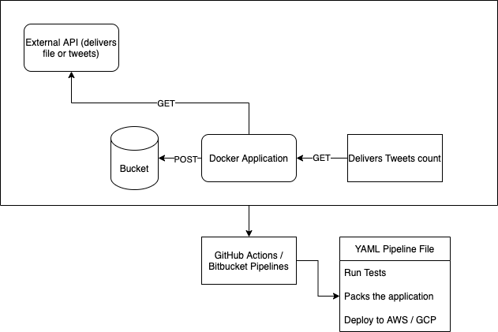

# Tweets Analyzer
## Usage
In order to run this application, run the following commands.

```
> docker-compose up --build
```
Then visit http://localhost:5000 to see the Hello World message.
If you want to process the file, you can access http://localhost:5000/count

## Diagram
